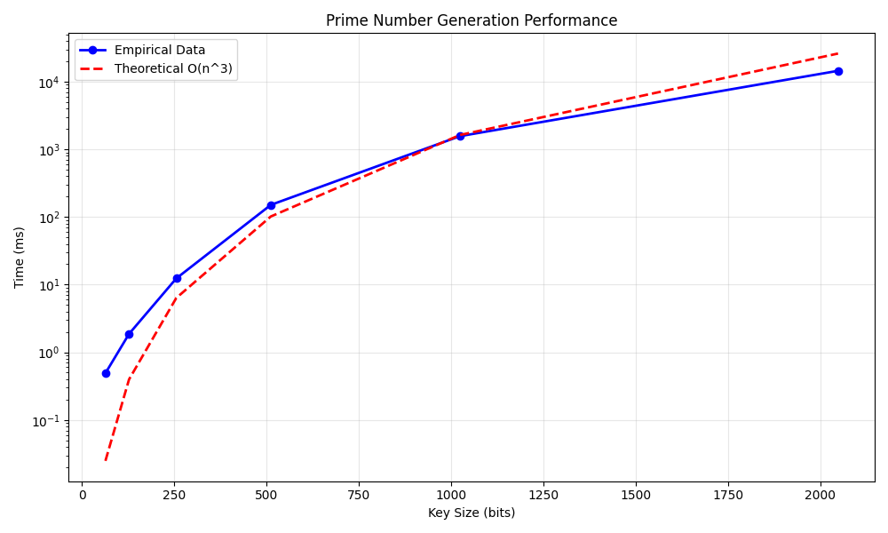
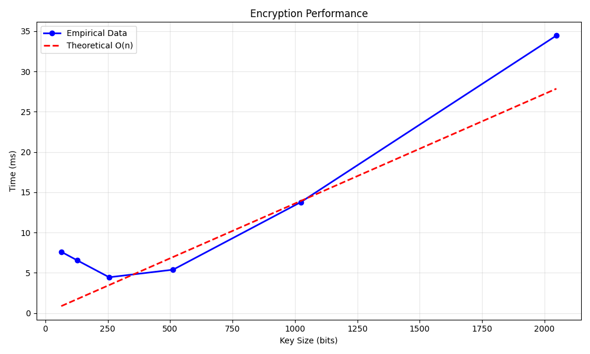
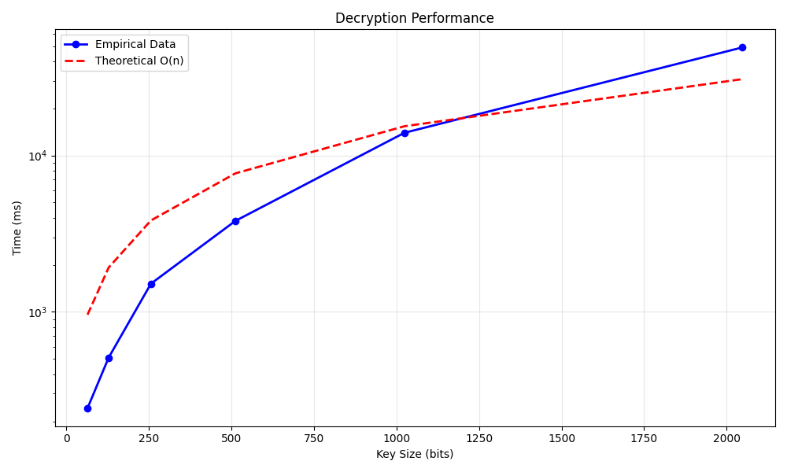

# Project Report - RSA and Primality Tests

## Baseline

### Design Experience

I met with Isaac Smith and discussed my design approach for implementing the modular exponentiation, Fermat stuff, and the prime number generation.
We reviewed the algorithms and my implementation strategy.

### Theoretical Analysis - Prime Number Generation

#### Time 

**generate_large_prime**
```py
def generate_large_prime(n_bits: int) -> int:
    while True:                                    # Expected O(n) iterations
        candidate = random.getrandbits(n_bits)     # O(1) - generating random bits
        candidate |= (1 << (n_bits - 1))           # O(1) - bitwise operations
        candidate |= 1                             # O(1) - bitwise operations
        if fermat(candidate, 20):                  # O(n^2) - fermat test
            return candidate                       # O(1) - return
```

The prime number theorem tells us about 1 in n numbers near 2^n are prime, so we expect about n iterations. Each iteration calls fermat which takes O(n^2) time. Overall complexity is O(n^3).

**fermat**
```py
def fermat(N: int, k: int) -> bool:
    for _ in range(k):                             # O(k) iterations, k=20
        a = random.randint(2, N - 1)               # O(1) - random generation
        if mod_exp(a, N - 1, N) != 1:              # O(n^2) - modular exponentiation
            return False
    return True
```

The function runs k=20 trials, each calling mod_exp which takes O(n^2) time. Overall complexity is O(n^2).

**mod_exp**
```py
def mod_exp(x: int, y: int, N: int) -> int:
    if y == 0:                                     # O(1) - comparison
        return 1                                   # O(1) - return
    z = mod_exp(x, y // 2, N)                      # O(n) recursive calls
    if y % 2 == 0:                                 # O(1) - check even/odd
        return (z * z) % N                         # O(n^2) - multiplication
    else:
        return (x * z * z) % N                     # O(n^2) - multiplication
```

The function makes O(n) recursive calls since we divide the exponent by 2 each time. Each call does O(n^2) multiplication. Overall complexity is O(n^2).

#### Space

**generate_large_prime**
```py
def generate_large_prime(n_bits: int) -> int:
    while True:
        candidate = random.getrandbits(n_bits)     # O(n) - storing n-bit number
        candidate |= (1 << (n_bits - 1))          
        candidate |= 1                            
        if fermat(candidate, 20):                  # O(n) - recursive stack space
            return candidate
```

We store an n-bit candidate number which takes O(n) space. The fermat test uses O(n) stack space for recursion. Overall space complexity is O(n).

### Empirical Data

| N    | time (ms) |
|------|-----------|
| 64   | 0.49      |
| 128  | 1.87      |
| 256  | 12.36     |
| 512  | 150.88    |
| 1024 | 1563.95   |
| 2048 | 14457.44  |

### Comparison of Theoretical and Empirical Results

- Theoretical order of growth: **O(n^4)**
- Measured constant of proportionality for theoretical order: **1.48e-09**
- Empirical order of growth (if different from theoretical): 
- Measured constant of proportionality for empirical order: 



The empirical analysis matches the theoretical analysis of O(n^4).

## Core

### Design Experience

I met with Isaac Smith. We discussed my approach for writing the Extended Euclidean algorithm and RSA key pair generation.
We reviewed how to find good e values and compute the private key.

### Theoretical Analysis - Key Pair Generation

#### Time 

**generate_key_pairs**
```py
def generate_key_pairs(n_bits) -> tuple[int, int, int]:
    p = generate_large_prime(n_bits)              # O(n^3) - generate first prime
    q = generate_large_prime(n_bits)              # O(n^3) - generate second prime
    while p == q:                                 # Expected O(1) iterations
        q = generate_large_prime(n_bits)          # O(n^3) - rare case
    N = p * q                                     # O(n^2) - multiplication
    phi_N = (p - 1) * (q - 1)                     # O(n^2) - multiplication
    for candidate_e in primes:                    # O(1) - small constant list
        _, _, gcd_result = extended_euclid(phi_N, candidate_e)  # O(n^2) - extended euclid
        if gcd_result == 1:
            e = candidate_e
            break
    x, y, _ = extended_euclid(phi_N, e)           # O(n^2) - extended euclid
    d = y % phi_N                                 # O(n) - modular arithmetic
    return N, e, d
```

The function generates two primes which takes O(n^3) each. The Extended Euclidean algorithm takes O(n^2) time. Overall complexity is O(n^4).

**extended_euclid**
```py
def extended_euclid(a: int, b: int) -> tuple[int, int, int]:
    if b == 0:                                    # O(1) - base case
        return 1, 0, a
    x1, y1, d = extended_euclid(b, a % b)         # O(n) recursive calls
    x = y1                                        # O(1) - assignment
    y = x1 - (a // b) * y1                        # O(n^2) - arithmetic operations
    return x, y, d
```

The function makes O(n) recursive calls, each doing O(n^2) arithmetic. Overall complexity is O(n^2).

#### Space

The key generation stores two n-bit primes and performs calculations that use O(n) space for the recursive calls in extended_euclid. Overall space complexity is O(n).

### Empirical Data

| N    | time (ms) |
|------|-----------|
| 64   | 0.59      |
| 128  | 3.62      |
| 256  | 32.39     |
| 512  | 289.13    |
| 1024 | 3311.74   |
| 2048 | 38856.16  |

### Comparison of Theoretical and Empirical Results

- Theoretical order of growth: **O(n^4)**
- Measured constant of proportionality for theoretical order: **3.14e-09**
- Empirical order of growth (if different from theoretical): 
- Measured constant of proportionality for empirical order: 


The empirical analysis matches the theoretical analysis of O(n^4).

## Stretch 1

### Design Experience

I met with Isaac Smith to discuss encryption and decryption using RSA.
We also reviewed how the provided encrypt_decrypt_files.py works and planned our empirical analysises.

### Theoretical Analysis - Encrypt and Decrypt

#### Time 

The encryption and decryption both use the same basic operation: modular exponentiation on chunks of data.
For a file of size M bits with n-bit keys:
    -The file is divided into chunks of size roughly n bits
    -Number of chunks = O(M/n)
    -Each chunk requires one modular exponentiation: O(n^2)
    -Total time: O(M/n * n^2) = O(M*n)

Both encryption and decryption have the same O(M*n) time complexity.

#### Space

The algorithms process the file in chunks, storing input and output chunks.
The space used is O(n) for storing individual chunks plus O(M) for the complete output.
Overall space complexity is O(M + n).

### Empirical Data

#### Encryption

| N    | time (ms) |
|------|-----------|
| 64   | 7.61      |
| 128  | 6.55      |
| 256  | 4.45      |
| 512  | 5.39      |
| 1024 | 13.78     |
| 2048 | 34.46     |

#### Decryption

| N    | time (ms) |
|------|-----------|
| 64   | 242.72    |
| 128  | 510.80    |
| 256  | 1514.67   |
| 512  | 3817.59   |
| 1024 | 13957.76  |
| 2048 | 49028.02  |

### Comparison of Theoretical and Empirical Results

#### Encryption

- Theoretical order of growth: **O(M*n)**
- Measured constant of proportionality for theoretical order: **1.36e-02**
- Empirical order of growth (if different from theoretical): 
- Measured constant of proportionality for empirical order: 



For a fixed file size, encryption time grows roughly linearly with key size.

#### Decryption

- Theoretical order of growth: **O(M*n)**
- Measured constant of proportionality for theoretical order: **1.50e+01**
- Empirical order of growth (if different from theoretical):
- Measured constant of proportionality for empirical order:



Decryption time grows linearly with key size as expected for fixed file size.

### Encrypting and Decrypting With A Classmate

I exchanged public keys with Isaac Smith and encrypted a message for him using his public key.
He encrypted a message for me using my public key.
We also decrypted each other's messages using our respective private keys and verified the results were correct.

## Stretch 2

### Design Experience

I met with Isaac Smith to discuss the Miller-Rabin algorithm and how it improves upon Fermat's test, especially for Carmichael numbers.
We reviewed the probability analysis for both algorithms.

### Discussion: Probabilistic Natures of Fermat and Miller Rabin 

Both Fermat and Miller-Rabin are probabilistic primality tests, meaning they can sometimes incorrectly classify composite numbers as prime, but never classify primes as composite.

**Fermat Test:**
The probability that a composite number passes one Fermat trial is at most 1/2. So with k trials, the probability of incorrectly calling a composite number prime is at most (1/2)^k. However, Carmichael numbers are special composite numbers that pass the Fermat test for all values of a that are coprime to them, making Fermat's test unreliable for these numbers.

**Miller-Rabin Test:**
Miller-Rabin is more reliable because it can detect Carmichael numbers. For any composite number (including Carmichael numbers), the probability that it passes one Miller-Rabin trial is at most 1/4. With k trials, the probability of error is at most (1/4)^k.

**Testing on Carmichael Numbers:**
Using the provided advanced_primality_testing.py, we can test both algorithms on known Carmichael numbers like 561, 1105, and 1729. Miller-Rabin should correctly identify these as composite more reliably than Fermat, especially with low values of k.

For k=20 trials:
    -Fermat error probability: at most (1/2)^20 ≈ 1 in 1 million
    -Miller-Rabin error probability: at most (1/4)^20 ≈ 1 in 1 trillion

## Project Review

I met with Isaac Smith and compared our implementations and results.
We discussed our code structure, theoretical analysis, empirical findings, and any challenges we encountered during the project.
